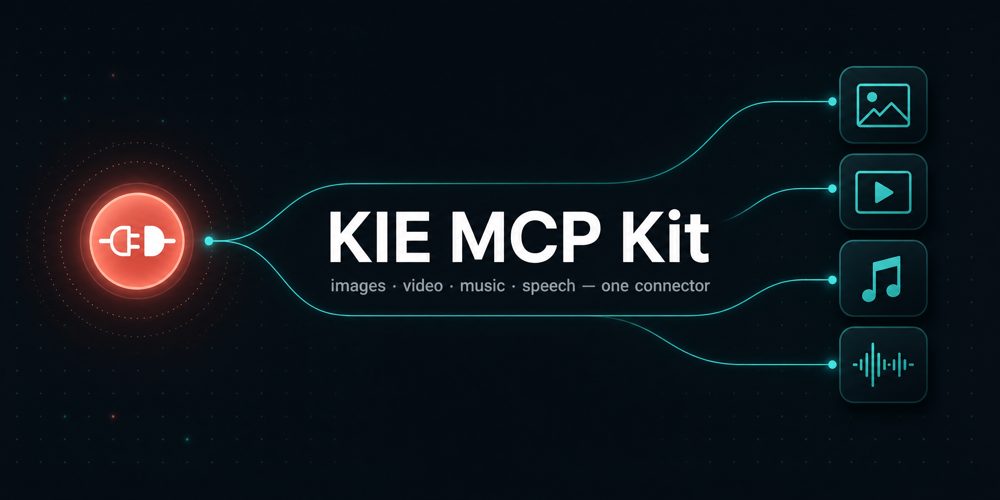

<div align="center">



# 🎨 KIE MCP Kit

**Пусть твой ИИ-агент генерит картинки, видео, музыку и речь прямо в чате — на самых свежих моделях.**

Seedance · Kling · Veo · GPT-Image-2 · Nano Banana · Flux · Suno · ElevenLabs — и всё новое, что выкатит KIE.

[](LICENSE)
[](https://kie.ai)
[](https://docs.claude.com/en/docs/claude-code)
[](https://docs.astral.sh/uv/)

[English](README.md) · **Русский**

</div>

---

## Что это

Готовый набор: **один MCP-коннектор + три скилла**, и твой агент (Claude Code, Claude Desktop, Codex) умеет сделать любой визуальный/аудио-ассет — или целую контент-кампанию — по обычной просьбе на человеческом языке.

| Компонент | Что делает |
|---|---|
| 🔌 **Коннектор** (`server/kie_server.py`) | Маленький MCP-сервер: 5 дженерик-тулзов, которые ходят в [KIE.ai](https://kie.ai) — агрегатор ~100 творческих моделей. Умышленно «тупой»: 5 универсальных тулзов вместо тулзы-на-модель. Новая модель KIE работает без правки коннектора — агент сам читает её доки. |
| 🧠 **generate-anything** | Одиночные ассеты. Ловит просьбу → выбирает модель → читает её доки → **называет цену в долларах и ждёт твоё «го»** → сабмитит, поллит, качает. |
| 🏭 **content-factory** | UGC-реклама продукта пачкой. 5 стадий: рисёрч → план → генерация (фото→видео, батчами) → расписание → отчёт затрат. |
| 📺 **youtube-factory** | Фейслес YouTube-видео. Рисёрч ниши (NexLev/vidIQ) → скрипт → картинка каждые 5–7с + анимация первых кадров → озвучка ElevenLabs → сборочный кит. |

> 💡 Ты не запоминаешь команды. Пишешь *«сделай вертикальное видео этой бутылки, UGC-стиль»* — остальное делает скилл.

---

## Требования

| Нужно | Зачем | Где взять |
|---|---|---|
| **API-ключ KIE.ai** | Оплачивает и авторизует генерации | [kie.ai](https://kie.ai) → Dashboard → API Keys |
| **[uv](https://docs.astral.sh/uv/)** | Запускает коннектор и сам ставит его Python-зависимости | `curl -LsSf https://astral.sh/uv/install.sh \| sh` |
| **MCP-клиент** | Управляет тулзами | Claude Code, Claude Desktop или Codex |

Python-зависимости коннектора (`fastmcp`, `requests`) объявлены прямо в скрипте — `uv` ставит их в эфемерное окружение при первом запуске. Никаких venv руками.

---

## Установка

### Шаг 1 — ключ KIE

Зайди на [kie.ai](https://kie.ai) → войди → **Dashboard → API Keys** → создай ключ и скопируй. Пополнение баланса там же (**1000 кредитов = $5**, т.е. **$0.005/кредит**).

### Шаг 2 — установка одной командой (Claude Code)

```bash
git clone https://github.com/yasdelayu/kie-mcp-kit && cd kie-mcp-kit
KIE_API_KEY=ТВОЙ_КЛЮЧ ./install.sh
```

Скрипт ставит все три скилла в `~/.claude/skills/` и регистрирует коннектор в Claude Code (user scope). Дальше — [Проверка](#проверка).

### Шаг 2 (альтернатива) — вручную

<details open>
<summary><b>Claude Code</b></summary>

```bash
# из папки склонированного репо:
claude mcp add --scope user kie \
  --env KIE_API_KEY=ТВОЙ_КЛЮЧ \
  -- uv run "$(pwd)/server/kie_server.py"
```

`--scope user` делает коннектор доступным в каждом проекте. Нужен project scope — убери `--scope user`.
</details>

<details>
<summary><b>Codex CLI</b></summary>

```bash
codex mcp add kie \
  --env KIE_API_KEY=ТВОЙ_КЛЮЧ \
  -- uv run /путь/к/kie-mcp-kit/server/kie_server.py
```
</details>

<details>
<summary><b>Claude Desktop / любой MCP-клиент</b></summary>

Вписать в конфиг клиента (Claude Desktop: **Settings → Developer → Edit Config**):

```json
{
  "mcpServers": {
    "kie": {
      "command": "uv",
      "args": ["run", "/путь/к/kie-mcp-kit/server/kie_server.py"],
      "env": { "KIE_API_KEY": "ТВОЙ_КЛЮЧ" }
    }
  }
}
```

Путь к `kie_server.py` — **абсолютный**. После правки полностью закрой и открой приложение.
</details>

### Шаг 3 — поставить скиллы (если коннектор ставил вручную)

```bash
mkdir -p ~/.claude/skills
cp -r skill/generate-anything  ~/.claude/skills/generate-anything
cp -r skill/content-factory    ~/.claude/skills/content-factory
cp -r skill/youtube-factory    ~/.claude/skills/youtube-factory
```

---

## Проверка

```bash
claude mcp list          # ожидаем:  kie  ✓ Connected
```

Затем в Claude Code попроси что-нибудь мелкое:

```text
Сколько будет стоить 5-секундное видео Seedance в 720p?
```

Скилл ответит ценой и ничего не сгенерит. Работает — значит всё готово. Сервер можно прогнать и напрямую (ключ не нужен — проверяется только чистая логика):

```bash
uv run server/kie_server.py --selftest      # печатает: selftest ok
```

---

## Как пользоваться

В основном ты просто говоришь агенту. Вот что что запускает.

### generate-anything — одиночные ассеты

| Скажи | Что будет |
|---|---|
| `Нарисуй уютную горную хижину на закате, 9:16` | картинка GPT-Image-2 |
| `Сделай 5с видео этого продукта, UGC handheld` (+ приложить фото) | still → видео Seedance |
| `Бодрый инструментал ~124 bpm под войсовер` | трек Suno |
| `Озвучь этот абзац тёплым женским голосом` | речь ElevenLabs |
| `Сколько будет стоить 10с видео Kling?` | только цена, без генерации |

Цикл всегда: скилл **называет модель и цену в долларах** и ждёт твоё **«го»**, потом сабмитит, поллит, качает файл. До «го» деньги не тратятся. Скажи *«хватит спрашивать, просто генери»* — уберёт ожидание (цену всё равно назовёт).

### content-factory — UGC-реклама пачкой

Запуск:

```text
Собери контент-кампанию для этого продукта — 100 UGC-роликов. (приложить фото продукта)
```

5 стадий, каждая — по кнопке, которую ты жмёшь:

1. **Рисёрч** — сканирует тренды недели в нише продукта → 15+ виральных идей.
2. **План** — красивый HTML-план: каждое видео размечено, датировано, разбито по 5 UGC-форматам (Entertainment · Street Interview · Unboxing · Product Review · ASMR).
3. **Генерация** — на каждую идею: still продукта (GPT-Image-2) → анимация в видео (Seedance), батчами с твоим подтверждением, + имидж-пак.
4. **Расписание** — экспортируемый CSV-календарь (или пуш в Meta Ads, если есть тот MCP).
5. **Отчёт затрат** — HTML: сколько реально ушло на KIE vs традиционное производство.

Вариативность идей берётся из [`skill/content-factory/references/prompt-library.md`](skill/content-factory/references/prompt-library.md) — концепт-сиды, сцены-хуки, сеттинги, шаблоны промптов по форматам.

Результат — в `./content-factory-output/<brand>/`.

### youtube-factory — фейслес YouTube-видео

Запуск:

```text
Разбери этот канал и сделай фейслес-видео по лучшей незанятой теме. (вставить URL канала)
```

Стадии: рисёрч ниши/конкурентов → скрипт закадра → картинка каждые 5–7с и **анимация первых кадров** (полностью статичные AI-видео YouTube приглушает) → озвучка ElevenLabs → сборочный кит + графика-оверлеи, готовые под монтаж.

Результат — в `./youtube-factory-output/<slug>/`.

---

## Опциональные интеграции

Кит работает сам по себе, но `youtube-factory` сильнее с подключённым MCP для YouTube-данных, а финальный монтаж можно собрать автоматически вместо ручного. Всё стороннее — ставится отдельно, в кит не входит.

| Доустановить | Что даёт | Зачем |
|---|---|---|
| [NexLev](https://nexlev.io) MCP | База YouTube-каналов — аналитика, аутлайеры, транскрипты, нишефайндер на 20k+. Есть официальный MCP для Claude. | Стадия 1 рисёрч: найти работающие каналы/видео и вытащить транскрипты конкурентов |
| [vidIQ](https://vidiq.com) MCP | Аналитика каналов + keyword research на большей базе | Стадия 1 рисёрч: альтернатива или дополнение к NexLev |
| **HyperFrames** (скилл Claude) | Рендерит готовое видео из HTML | Стадия 5: авто-сборка видео вместо ручного монтажа |
| [CapCut](https://www.capcut.com) | Ручной видеоредактор | Стадия 5: собрать вручную из выхлопа кита |

> Без рисёрч-MCP Стадия 1 падает на обычный web-поиск — работает, просто с меньшим объёмом YouTube-специфичных данных.

---

## Тулзы коннектора

| Тулза | Что делает |
|---|---|
| `kie_post(path, body)` | POST на любой эндпоинт KIE — **сабмит** задачи (обычно `/api/v1/jobs/createTask`). |
| `kie_get(path)` | GET — **поллинг** статуса (`/api/v1/jobs/recordInfo?taskId=…`) или проверка баланса. |
| `kie_upload_file(localPath, uploadPath?)` | Локальный медиа-файл → hosted-URL KIE (~3 дня) под `@Image`/`@Video`. |
| `kie_download(url, destPath)` | Скачать результат на диск (создаёт папки; отказывает скриптам/исполняемым). |
| `kie_fetch_model_docs(path\|url, force?)` | Живые доки модели с docs.kie.ai (кэш ~3 дня). |
| ресурс `kie://models` | Живой каталог моделей KIE — точка старта, когда задача не из дефолтов. |

**Жизненный цикл джоба:** `POST /api/v1/jobs/createTask {model, input}` → сохранить `taskId` → `GET /api/v1/jobs/recordInfo?taskId=…` до `state:success` → скачать `resultJson.resultUrls[]`. Исключения: **Veo** (`/api/v1/veo/generate`, `successFlag`) и **Suno** (`/api/v1/generate`) — свои envelope, скиллы сначала читают их доки. **Баланс:** `GET /api/v1/chat/credit` → `data` = число кредитов.

---

## Переменные окружения

| Переменная | Дефолт | Обязательна |
|---|---|---|
| `KIE_API_KEY` | — | **Да** |
| `KIE_BASE_URL` | `https://api.kie.ai` | Нет |
| `KIE_UPLOAD_URL` | `https://kieai.redpandaai.co/api/file-stream-upload` | Нет |
| `KIE_DOCS_BASE` | `https://docs.kie.ai` | Нет |
| `KIE_WORKSPACE_DIR` | *(не задана — берётся рабочая папка)* | Рекомендуется |

Задаются в блоке `env` твоего MCP-клиента (см. конфиг выше). Файловые тулзы **всегда** заперты в workspace: это `KIE_WORKSPACE_DIR`, если задана, иначе рабочая папка сервера. Ставь её на папку проекта — сервер, запущенный клиентом, может унаследовать произвольную рабочую папку, а `/` и голый домашний каталог отвергаются сразу.

---

## Безопасность

- 🔑 Ключ хранится в настройках клиента / переменной окружения, **никогда** не в репо.
- 🌐 API-ключ уходит только на хосты KIE (`KIE_BASE_URL` / `KIE_UPLOAD_URL`); на чужой origin коннектор запрос не пустит, при кросс-origin редиректе креды сбрасываются.
- 📁 Аплоад/даунлоад заперты в workspace (`KIE_WORKSPACE_DIR`, иначе рабочая папка), симлинки учитываются; `/` и голый домашний каталог отвергаются.
- 🖼️ Оба направления ограничены **allowlist'ом** медиа-типов, так что скрипт, исполняемый файл или dotfile недостижимы — включая имена, которые перепишет Windows (`clip.mp4.` → `clip.mp4`).

---

## Если что-то не так

| Симптом | Решение |
|---|---|
| `uv: command not found` | Поставь uv: `curl -LsSf https://astral.sh/uv/install.sh \| sh`, перезапусти шелл. |
| `claude mcp list` показывает `kie ✗` | Проверь, что путь к `server/kie_server.py` абсолютный и верный; что `KIE_API_KEY` задан в env клиента; перезапусти клиент. |
| `Blocked: … may only reach …` | Тулзу направили на не-KIE хост. Оставь `KIE_BASE_URL`/`KIE_UPLOAD_URL` дефолтными, если KIE не говорит иначе. |
| `500` на сабмите | Транзиентно — повтори. Неудачный сабмит стоит 0 кредитов. |
| Джоб `state: fail` | Читай `failMsg`. Отказ фильтра (напр. название студии) требует переписать промпт, а не ретрай. |
| Не хватает кредитов | Пополни на kie.ai. Спроси *«сколько у меня осталось?»* — проверит баланс. |

---

## Обновление и удаление

```bash
# обновить
cd kie-mcp-kit && git pull                        # коннектор подхватится при следующем рестарте
KIE_API_KEY=ТВОЙ_КЛЮЧ ./install.sh --force        # только если менялись скиллы

# удалить
claude mcp remove kie
rm -rf ~/.claude/skills/{generate-anything,content-factory,youtube-factory}
```

---

## Поддержать

Если кит экономит тебе время — можешь закинуть автору:

- **USDT (TRC-20):** `TWVSReEvpN4fqDQHMPzmo5zM4ij9iB44CH` → [посмотреть на Tronscan](https://tronscan.org/#/address/TWVSReEvpN4fqDQHMPzmo5zM4ij9iB44CH)

> ⚠️ **Только сеть TRC-20 (TRON)** — USDT в другой сети потеряется. Донат идёт на этот open-source кит, не в KIE.ai и не вендорам моделей.

---

## Кредиты и лицензия

- 🔌 **Коннектор** — [@yasdelayu](https://github.com/yasdelayu), собственная реализация 5-тулзового MCP поверх [KIE.ai API](https://docs.kie.ai). MIT.
- 🧠 **generate-anything** — Anthropic.
- 🏭 **content-factory** / 📺 **youtube-factory** — [@yasdelayu](https://github.com/yasdelayu) (MIT). Собственные KIE-нативные контент-пайплайны.
- **[KIE.ai](https://kie.ai)** — сторонний агрегатор моделей, к которому подключается коннектор (не аффилирован). NexLev / vidIQ — сторонние MCP, используются только если ты их подключишь.

Подробнее — [CREDITS.md](CREDITS.md). Лицензия — [MIT](LICENSE).
